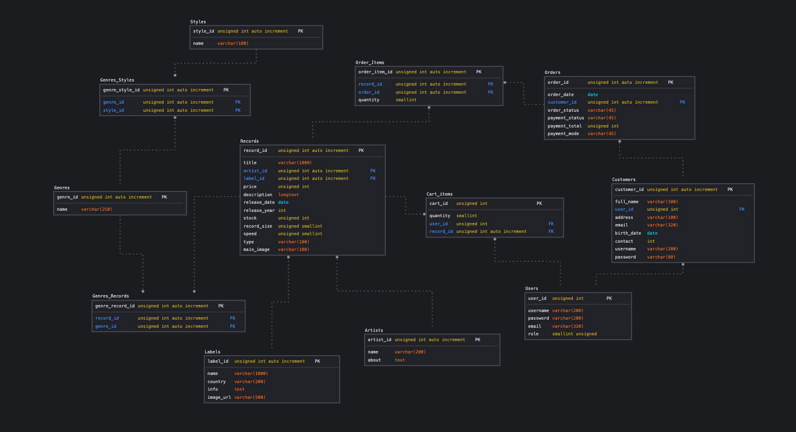
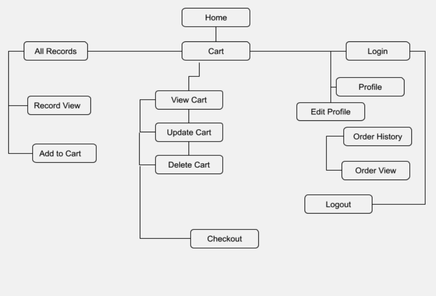

# Full Stack E-commerce Web Development 
# The Vinyl Jukebox 

This is a full stack e-commerce project built for educational purposes. The frontend development is built using the 5 planes of UX Design. Website is built on ReactJs using functional components, react-router-dom, react hooks and Context api.

## Live Access 

E-commerce - https://the-vinyl-jukebox.netlify.app/

#### Admin Site
Admin - https://illy-vinylshop.herokuapp.com/

| Email | Password    |                
| :-------- | :------- | 
| `rotijohn@gemail.com` | `test1234` |  

Please note that Heroku will take up to 30 seconds to load.

# Strategy
In recents years vinyl records have dramatically increased in popularity - even outselling digital music. Many new releases are available on vinyl and even older releases are now being reissued on vinyl. While large, international sites such as Discogs, or non-specialist sites such as eBay focus on the secondhand and collectible record trade, there is little in the way of sites that focus on the new releases of vinyl.

#### Target Audience
- Music lovers
- Collectors
- Musicians/DJs
- Vintage decorators

### Site Owner Goals
As a site owner, I aim to cater to lovers and collectors of vinyl records so that they have the option to view, select and purchase the records from the comfort of home. 

As a site owner, I want to ensure a collection of visually pleasing new released records for customers to access. 

### User Goals

As a user of the website, I want to be able to easily find the latest LP releases so that I can save time from going down in person.

As a user of the website, I want somewhere where I am able to browse LPs by labels or genres without leaving the comfort of my home. 

As a vinyl record collector, I want to have a website that is easy to search, shop and pay for my purchases. 

As a vintage decor fan, I want a seamless site where I can browse through and view each pic of the album sleeve without having to deep dive endlessly at a physical store.

# Scope

### Functional

1. Call to Action brings user to full products page 
2. Quick Search modal - search by title/artist 
3. Search filters on main product page
- By titles
- By labels
- By genres
4. Dynamic shopping cart with quicklink to checkout page on navbar
5. Login/Register pages 
6. Protected edit profile/view order history route 

### Content 

1. Home page showcases 'BESTSELLER' heading that is sorted into 4 random products each time page is loaded 
2. Single record view lists product specs, record description and record label name with thumbnail image 
3. Shopping cart page shows berakdown of items added by quantity and subtotal 
4. Order history page allows user to view all previous orders by clicking on button link 

### Non-functional

1. Mobile responsiveness
2. Navbar drawer
2. Loading spinner
3. Footer 
4. Scroll to top button 

# Structure 
Logical Schema that the website and database was built on 

# Skeleton 
As this is a single page application, the site skeleton is as follows. React-router-dom helps to show routes in web address when user navigate around our site. 

# Surface

The design strategy for the website is to exude a vintage analog feel. This also helps in allowing the photos of the album sleeves to stand out thus catering to both vintage collectors and music lovers at the same time. 

## Color scheme 
Selected Monochrome colors 

## Font
Inconsolata from [Google Fonts](https://fonts.google.com/specimen/Inconsolata?preview.text=vinyl%20shop&preview.text_type=custom#standard-styles)

This font was selected to give off an analog vibe relating to the website brand. 

## Testing 

#### As a registered user 

| Email | Password    |                
| :-------- | :------- | 
| `test@gemail` | `test1234` |  

1. Click on login page and enters required information. Validation is done and error message appears if password does not match or email is not registered. 
    - User is able to login
2. Clicking on search icon in navbar will allow a quick search of products, customer can click on link to bring them directly to the page. 
    - User is able to click on search icon, modal opens and dynamic search works. User is brought to single record view page upon clicking view. 
3. From record view page, clicking add to cart shows alert if item successfully added, cart icon switches 1 item in cart. 
    - User is able to add to cart, alert shows up. Cart icon works. 
4. Customer clicks on records in navbar. 
    - User is brought to all products page. 
5. Customer searches for genres rock, click search button. 
    - Item is rendered on page. 
6. Clicking on shopping cart icon shows a breakdown of items, quantity and subtotal. 
7. Customer clicks on view cart link, bringing them to checkout page. 
    - User is brought to view cart page. 
8. Clicking checkout brings customer to Stripe payment page. 
    - Stripe API is called here, showing correct shop branding. 
9. Checkout page is pre-filled with customer's email. 
10. Customer checks out using test information 
    - Card Number: 4242 4242 4242 4242
    - Expiry: 08/24
    - CCV: 999
    - Name: Customer name 
11. Upon successful payment, customer is redirected to All Orders page. 
    - User sees all orders page. 
12. Customer clicks on view more to check latest order information.  
    - User sees breakdown of item, quantity, total and user information. 

#### As a guest 

1. Guest is at homepage, clicks on records page. 
    - User sees all records information. 
2. Guest selects a record. 
    - User is brought to single record view. 
3. Guest clicks add to cart. 
    - Alert in red prompts, asking user to login and retry.
4. Guest clicks on login link, then click on signup link. Guest enters required information. Validation helpers for form controls will prompt if fields are not acceptable. 
    - User is able to sign up, user is brought to login page. 

#### Known issues
1. User might be automatically logged out if page is refreshed though this does not occur all the time. 
2. Most times cart icon tabulates and shows the correct number of items however there are instances where the cart seems to lag. For now, the best way to get the updated info is to click on View Cart page accessed via cart icon dropdown or profile page.  

## Future Implementations

### Frontend

- Automatically logging in a new customer if registration is successful and redirecting to home page instead 
- Implementing pagination for better customer experience
- Adding more search filters to allow customers to find their desired product faster
- Adding add/subtract/delete cart information on cart icon dropdown
- Setting up a reset Password Link for customers who may have forgotten their password 

### Backend
- Allowing access for different admin levels
- Adding a quantity overview page for stock keeping
- Allowing admin to verify that stock is available before confirming orders 
- Allowing admin to edit customer list

# Technologies

- NodeJs and Express
- ReactJs with React Hooks, Context API, React-router-Dom
- UI built with [React-Bootstrap](https://react-bootstrap.github.io/), [Bootstrap](http://getbootstrap.com/)
- [React Icons](https://react-icons.github.io/react-icons/)
- [react-select](https://react-select.com/) for seaching multiple tags
- momentJS 
- [Stripe API](https://stripe.com/en-gb-sg) for payment
- Database created with MySQL and Postgres
- [Knex.js](http://knexjs.org/) & [Bookshelf ORM](https://bookshelfjs.org/) for building of MySQL query
- [db-migrate](https://db-migrate.readthedocs.io/en/latest/) for database migrations
- [CSURF](github.com/expressjs/csurf)
- [Caolan forms](https://github.com/caolan/forms) for form building in admin site
- Axios for connecting to API
- CORS to allow exchanges
- [Caolan forms](github.com/caolan/forms)
- [JSON web tokens](https://github.com/auth0/node-jsonwebtoken)
- flash, session-file-store and express-sessions
- [Handlebars](https://handlebarsjs.com/) for admin site UI
- [Cloudinary](https://cloudinary.com/) for image uploads

# Credits

All photos and content are sourced and adapted from 
[Pexels.com](https://www.pexels.com/)
[The Analog Vault](https://theanalogvault.com/)
[The Sound of Vinyl](https://thesoundofvinyl.com/)
[eBay](https://www.ebay.com/b/Vinyl-Records/176985/bn_1860303)

Repository for server side and Admin access can be found [here](https://github.com/illydali/proj3-ecomm)

Deployment is done on [Heroku](https://www.heroku.com/) and [Netlify](https://www.netlify.com/). 

# Acknowledgements
Lecturer [Paul Chor](https://github.com/kunxin-chor) for imparting his skills.

TAs Ace, Haryati and Chen Yun for being patient and spending time to figure out our bugs.

The class of TGC16 for always being ready to share all knowledge, shortcuts and problem-fixes. 

*Data used in the development of this website is for educational purposes only and may or may not be accurate.*