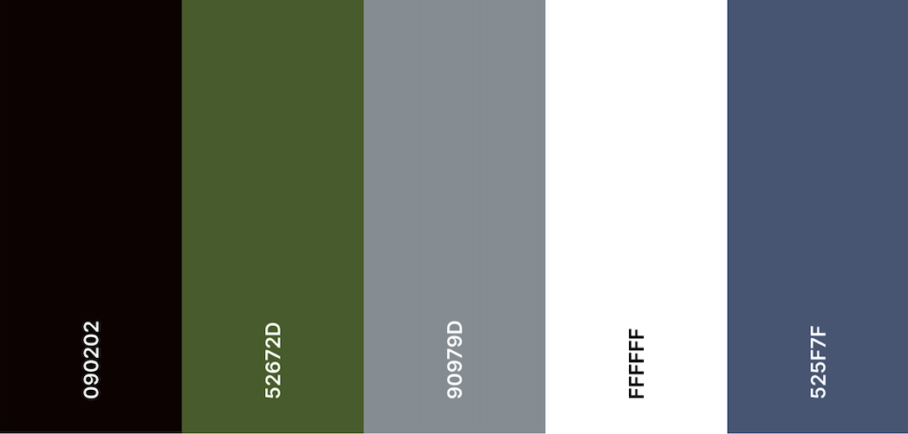

# Full Stack E-commerce Web Development 
# The Vinyl Jukebox 

This is a full stack e-commerce project built for educational purposes. The frontend development is built using the 5 planes of UX Design. This site is built on ReactJS. 

## Live Access 

E-commerce - https://the-vinyl-jukebox.netlify.app/

#### Admin Site
Admin - https://illy-vinylshop.herokuapp.com/

| Email | Password    |                
| :-------- | :------- | 
| `rotijohn@gemail.com` | `rotijohn` |  

Please note that Heroku will take up to 30 seconds to load.

# Strategy
In recents years vinyl records have dramatically increased in popularity - even outselling digital music. Many new releases are available on vinyl and even older releases are now being reissued on vinyl. With the exception of large, international sites such as Discogs, or non-specialist sites such as eBay there is little in the way of sites that focus on the secondhand and collectible record trade.

#### Target Audience
- Music lovers
- Collectors
- Musicians/DJs
- Vintage decorators

### Site Owner Goals
As a site owner, I aim to cater to lovers and collectors of vinyl records so that they have the option to view, select and purchase the records from the comfort of home. 

### User Goals

As a user of the website, I want to be able to easily find the latest LP releases so that I can save time from going down in person.

As a user of the website, I want somewhere where I am able to browse LPs by labels or genres without leaving the comfort of my home. 

As a vinyl record collector, I want to have a website that is easy to search, shop and pay for my purchases. 

As a vintage decor fan, I want a seamless site where I can browse through and view each pic of the album sleeve without having to deep dive endlessly at a physical store.

# Scope

### Functional

1. Call to Action brings user to full products page. 
2. Quick Search modal
3. Search filters 
- By titles
- By labels
- By genres
4. Dynamic shopping cart with quicklink to checkout page
5. Login/Register pages 
6. Protected edit profile/view order history route 

### Non-functional

1. Mobile responsiveness
2. Navbar drawer
2. Loading spinner
3. Footer 
4. Scroll to top button 

# Structure 
Logical Schema that the website and database was built on, 

# Skeleton 
Basic skeleton 

# Surface

The design strategy for the website is to exude a vintage analog feel. This also helps in allowing the photos of the album sleeves to stand out thus catering to vintage collectors and music lovers at the same time. 

## Color scheme 
Selected Monochrome colors 

## Font
Inconsolata from [Google Fonts](https://fonts.google.com/specimen/Inconsolata?preview.text=vinyl%20shop&preview.text_type=custom#standard-styles)

# Technologies

ReactJs - React Hooks,Context API, React-router-Dom

React-Bootstrap, Bootstrap 5.1, react-select, react-icons 

Postgres 

Stripe API 

MomentJS

# Credits
Photos and content are sourced and adapted from 
[Pexels.com](https://www.pexels.com/)
[The Analog Vault](https://theanalogvault.com/)
[The Sound of Vinyl](https://thesoundofvinyl.com/)
[eBay](https://www.ebay.com/b/Vinyl-Records/176985/bn_1860303)

